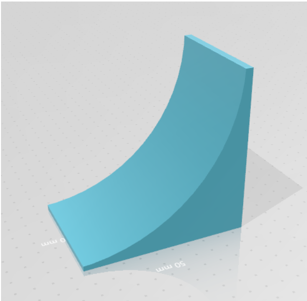

<!--  -->

# C.A.R.L.E.S. Robotics Project
 Card-playing Algorithmic Robot for Leisure and Elder Socializing (_C.A.R.L.E.S._)

# Table of Contents

   * [What is this?](#what-is-this)
   <!--* [Requirements](#requirements)
   * [Documentation](#documentation)
   * [How to use](#how-to-use)-->
   * [Description](#Description)
   * [Amazing contributions](#Amazing-contributions)
   * [Hardware Scheme](#Hardware-Scheme)   
   * [3D pieces](#3D-pieces)
   * [Software Architecture](#Software-Architecture)
   * [Modules](#modules)
      * [Brisca AI](#Brisca-AI)
      * [Card Detection with computer vision](#Card-Detection-with-computer-vision)
      * [Inverse kinematics algorithm visualizer](#Inverse-kinematics-algorithm-visualizer)
      * [Big Simulation](#Big-Simulation)

   * [Support](#support)
   * [Authors](#authors)

# What is this?

We are 3rd year Computer Science students and this is a robotics project for our subject on Robòtica, Llenguatge i Planificació - Robotics Language and Planning.

We have focused deeply on polishing the software part of the project, but due to the circumstances (this project was interrupted by the 2020 Coronavirus outbreak), we haven't been able to implement it on hardware. Instead, we have prepared a full-on videogame to act as a simulation for what this project can become. And it is prepared for anyone to take it and move our sofware modules to a phisical robot.

This is where you come in!

# Description
_C.A.R.L.E.S_ is a robot capable of playing 1vs1 (Human vs AI)  the typical Spanish game of brisca.
The main mechanism consists of a 3-axis anthropomorphic arm, which allows movement in a circular area on the board. At the end of the last shaft there is a manipulator formed by a suction cup, which is controlled by a pneumatic mechanism with a servomotor and a syringe. This mechanism allows the robot to pick up and move cards. The board adapts to the course of the arm, while maintaining as much as possible the typical layout of the brisca game. The robot's hand is on its right and elevated so it is possible to fit a camera inside the box that holds them and thus be able to perform card recognition by computer vision. This way the robot is aware of his cards values. Each player's cards, trump card and deck are in the center of the board. There is also second camera lifted from the table that controls the playing area. This way it is also aware of the cards played. Finally, to the left of the arm there is a mechanism that allows the robot to spin a card.

However, the hardware planification we just described was not possible to perform due to education context in COVID-19 pandemic. We had to change the main focus to pure software development and the polishing of each module itself and as a whole.

_C.A.R.L.E.S_ is able to:
- Recognize cards with the computer vision module (number and stick of the card).
- Play a brisca game with an AI algorithm that will do its best to outsmart the opponent.
- Control the actions to be performed (start and end game, steal a card, know that it is the turn of the shift, etc.) by voice commands that the human will say during the game.
- Calculate the angles of rotation of the arm motors in order to move the manipulator (including the one that controls the pressure of the suction cup) from one point to another, according to the movements that should be made in case of its physical creation.
- Unification of all the modules in a single workflow, which should be what the physical robot had.

# Amazing contributions

The three most important contributions in which our robot stands up are:
- Entertainment for seniors:  it is designed to entertain the elderly, for whom robots are a whole new thing.
- Classic Game Automation, the brisca: we give life to a classic and mythical game like the brisca combining it with technology and having it be even more enjoyable.
- Voice recognition with human interaction: Designed to bring the user closer to the robot and allows them to communicate with it.

# Hardware Scheme
This is the Hardware Scheme we planned for this project, within the 100€ budget we had. It's free for anyone to use it but we'd heavily recommend, if they're going to invest in making this project, to put some better hardware on it.

# 3D pieces
Edited and personalized pieces for _C.A.R.L.E.S._ with name annotation.

# Software Architecture
this is the software architecture of the project with the hardware components to, is not the ones we have finally done cause the changes of the evaluation method made us change a few thinks.
We finally separate from the project a few parts and we have made them a part. These are the parts we separate:
* The module of Computer Vision
* The human interaction
* The realistic cinematic.

## Modules

### Brisca AI
Requirements for the algorithm: python 3

The first module is the AI that drives the game flow, it's the one who decides which card to choose from those on _C.A.R.L.E.S._' hand, based on what a human player could see, and more. It is explained in more detail in the [report](https://github.com/OriolMoreno/C.A.R.L.E.S/blob/master/reports/RLP_SPRINT_5%20-%20Final%20Report.pdf)), both it's python version for the actual raspberry pi-driven robot and the rework we made for the Unity videogame.

### Card Detection with computer vision
We made a program based on computer vision able to detect the number and suit of a card with any rotation and different backgrounds and illuminations. Here we show a part of the process: 

Requirements: Python 3, and its libraries numpy, cv2, imutils, math and scipy.

### Inverse kinematics algorithm + visualizer

This algorithm built from scratch is based on the geometric inverse kinematics method for calculating arm degrees from coordinates, and the smooth movement between two points is calculated using a continuous rectiliniar trajectory.

The visualizer takes an imput of an x,y,z position inside the workspace and shows an animation of _C.A.R.L.E.S._' arm doing the designated trajectory. As an example, this is the animation it'd play as a celebration when winning the game:

Requirements for the algorithm: Python 3 and the numpy and maths libraries. For visualization, matplotlib and scipy are also needed.

### Voice recognition

This module is based on google's speech recognition API, and it's used to analize the human opponent's orders, and guess which of the possible actions the user is requesting. This is sent to the main controller, which will send the information to the AI module if necessary.

Requirements: Python 3 and its libraries google-cloud-speech, google-auth-oauthlib, sounddevice and soundfile.

### Videogame Simulation
Finally, to show how it would have been had we been able to implement on harware, we've build a simulation videogame, in which you can play full Brisca matches against _C.A.R.L.E.S._! In it, there's the brisca player algorithm adapted for the simulation (further detail on the [report](https://github.com/OriolMoreno/C.A.R.L.E.S/blob/master/reports/RLP_SPRINT_5%20-%20Final%20Report.pdf)), and we've also added some of the Human Interaction part of the project, as _C.A.R.L.E.S._ speaks and grunts during the match.

Here's a little demo of the game, but you can download it yourself! See the [Downloads section](#Downloads).

# Video
Short video showing all the functionalities of the project.

Click the animated gif for the full version!

# Downloads
[Windows](https://github.com/OriolMoreno/C.A.R.L.E.S/blob/master/simulation.exe)

[Android](https://github.com/OriolMoreno/C.A.R.L.E.S/blob/master/carles.apk)

For MacOs you'll have to clone the repo and you'll find it under unity_simulation/BuildMacOs

# Authors

- [ADRIÀ CARRASQUILLA](https://github.com/adriacarrasquilla) - 1492104

- [ORIOL MORENO](https://github.com/OriolMoreno) - 1496663

- [JAN MOROS](https://github.com/janMoros) - 1492333

- [VÍCTOR SUÁREZ](https://github.com/VictorSuarezVara) - 1493402
